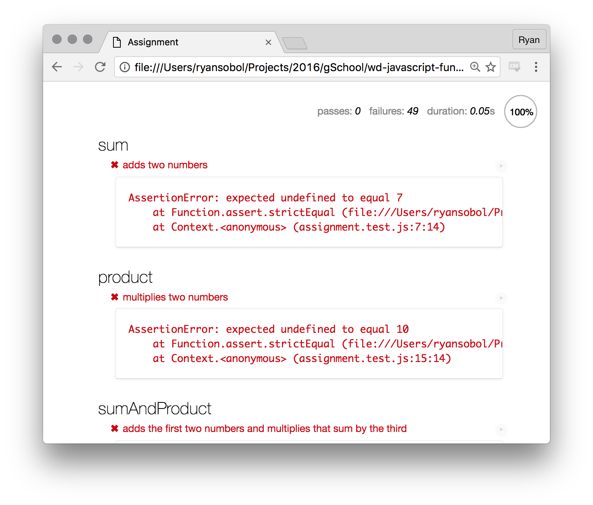

# JavaScript Fundamentals

This exercise reinforces the fundamentals of JavaScript and is split into two parts. Part 1 has you wrestling with core JavaScript concepts.

- Primitives
- Declarations
- Functions
- Globals
- Operators
- Control flow

While part 2 builds on the above and has you wrestling with more essential concepts.

- Arrays
- Objects
- Iterations

Furthermore, each part has two components—an **assignment** and a **bonus**. Complete the each part's assignment before moving on to its respective bonus or the next part's assignment.

### Objectives

To complete this exercise, you must do the following.

- Solve puzzles using fundamental JavaScript concepts
- Use online documentation to lookup how to use unfamiliar concepts

### Setup

To get started, get this code onto your machine by following these setup instructions.

1. Fork this repository to your own GitHub account.
1. Clone your forked repository to your development environment.
1. Open the repository's project directory in your text editor.
1. Open the `part1/assignment.html` file in your web browser.

In your web browser, you'll see a page that shows a bunch of failing JavaScript tests. Locate the area that shows how many tests are passing and how many are failing.

### How to proceed

Your job is to make all these JavaScript tests pass by completing their respective puzzle.

1. Open the `part1/assignment.js` file in your text editor.
1. Read the instructions for each puzzle.
1. Solve the puzzle by writing JavaScript.

To test your puzzle's solution:

1. Tab over to the browser with `Command + Tab`.
1. Refresh the browser with `Command + R`.
1. Scroll to the puzzle's test and see if it's still red.
1. Once the test is green, you've solved the puzzle.

You can see how each test invokes the puzzle's function by clicking on the test description.

**TIP:** Check your work after every small change.

### Wrestle with it

You may encounter challenges that seem confusing or impossible. Don't fret! This exercise is designed to challenge you. Resist the urge to just copy-paste code from your classmates, but definitely ask for help and talk to your peers.

### What success looks like

When you're done with the main assignment, your page should look like this. Green check marks next to each exercise means all tests are passing.

### Bonus

Want more? There's a whole 'nother test suite just waiting for you!

1. Open the `part1/bonus.html` file in your web browser.
1. Open the `part1/bonus.js` file in your text editor.
1. You know the drill :)

### But wait, there's more!

Part 2 is under construction...

### Submitting your work

When you're ready to submit your work:

1. Push your code up to GitHub, the `origin` remote.
1. Copy the URL to you repository from your web browser's address bar.
1. Paste that URL in the textfield for the related exercise.
